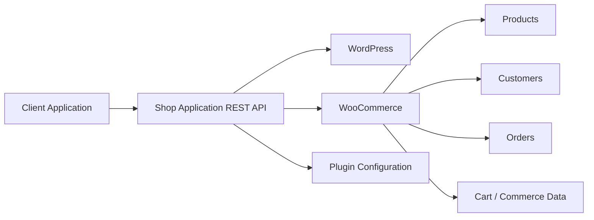

<div align="center">

# Shop Application

### REST API & Application Management Layer for WordPress + WooCommerce

A reusable WordPress plugin for building application-facing web services on top of WooCommerce, with a configurable admin interface and a clean, consistent API contract.


</div>

---

## Overview

**Shop Application** provides a dedicated API layer between a WooCommerce store and external applications such as mobile apps, desktop clients, PWAs, kiosks, or other custom frontends.

The plugin is designed to keep application responses compact, predictable, and easier to consume than the full WooCommerce REST payload, while still using WordPress and WooCommerce as the primary source of product, customer, category, order, and store data.

Its architecture is intentionally reusable and is not tied to a specific store, theme, application framework, or frontend technology.

---

## Main Goals

- Reduce unnecessary requests between an application and the store.
- Provide application-oriented JSON responses instead of exposing large WooCommerce payloads directly.
- Keep product, category, customer, authentication, and store data consistent with WooCommerce.
- Allow site administrators to control application-facing content from WordPress.
- Support server-driven page structures where appropriate.
- Keep API contracts predictable and easy to integrate with different frontend technologies.
- Provide a foundation for future customer, cart, wishlist, notification, and administrative services.

---

## Key Features

### Application-focused REST APIs

The plugin exposes dedicated REST endpoints for common store workflows, including areas such as:

- Home page content
- Product lists
- Product details
- Category pages
- Category details
- Authentication
- Customer/account data

Responses are normalized for application use and avoid unnecessary WooCommerce fields where possible.

### WooCommerce-aware product handling

Product responses are designed for both simple and variable products, including application-friendly handling of:

- Prices and regular prices
- Discounts
- Stock quantities
- Product images and galleries
- Product variations
- Categories and brands
- Ratings and sales data
- Product attributes
- Related products

WooCommerce remains responsible for the underlying product and commerce logic.

### Server-driven application content

Administrators can manage application-facing sections directly from WordPress without hard-coding page content into the client application.

Supported section concepts include:

- Images and banners
- Product lists
- Category lists
- Brand lists
- Posts and content sections

Each supported page can define its own structure and behavior while keeping the API response consistent.

### Authentication layer

The plugin includes an application authentication layer that can work with a single user identifier field and detect supported identifier types such as:

- Username
- Email address
- Mobile number

Authenticated endpoints can use application access tokens instead of exposing WordPress or WooCommerce administrative credentials to client applications.

### Customer web services

The architecture supports authenticated customer-facing data such as:

- Customer profile information
- Billing address
- Shipping address
- Orders
- Persistent cart data
- Downloads
- Extensible wishlist integrations

### Dedicated administration interface

Shop Application adds its own administration area to WordPress rather than placing application management inside WooCommerce settings.

The administration interface is organized around areas such as:

- Application management
- Web services
- Settings
- Tools

The interface is designed to remain usable on both desktop and smaller screens.

---

## Architecture



The plugin acts as an application-facing service layer. It does **not** replace WooCommerce as the commerce engine.

---

## Web Service Organization

The administration area separates services by responsibility so the plugin can grow without turning into a single crowded settings screen.

### Customer Web Services

Customer-facing services are separated into two practical groups:

- Services that can be consumed without an authenticated customer session.
- Services that require a valid authenticated customer account.

### Authentication Web Services

Authentication endpoints are kept separate from general customer APIs so login and registration flows can evolve independently.

### Administrator Web Services

The architecture includes a dedicated area for future administrator-facing APIs and management operations.

### Notification Web Services

A dedicated notification area is reserved for future push, transactional, stock, cart, order, and customer engagement workflows.

---

## Installation

1. Download or clone the plugin repository.
2. Make sure the plugin directory is named:

   ```text
   shop-application
   ```

3. Place it inside:

   ```text
   wp-content/plugins/
   ```

4. Activate **اپلیکیشن فروشگاه** from the WordPress Plugins screen.
5. Make sure WooCommerce is installed and active.
6. Open the **اپلیکیشن فروشگاه** menu in the WordPress administration panel.

---

## API Design Principles

Shop Application follows a few core rules:

- Responses should be consistent across similar resources.
- Identical concepts should use identical field names.
- Numeric values should be returned using appropriate JSON numeric types.
- Empty collections should be returned as arrays rather than ambiguous values.
- Client applications should not need to understand WooCommerce internals.
- Sensitive administrative credentials must never be embedded in a client application.
- Server-side validation remains authoritative for prices, stock, permissions, and commerce operations.
- Public and authenticated endpoints should be clearly separated.

---

## Security

The plugin is designed around standard WordPress security practices, including:

- REST permission callbacks
- Input validation and sanitization
- WordPress capability checks for administrative screens
- Server-side authorization for protected endpoints
- Token-based application authentication
- No requirement to expose WooCommerce Consumer Secret credentials inside a client application

For production deployments, HTTPS should always be enabled.

---

## Extensibility

The project is intended to remain store-agnostic and extensible.

Integrations that vary between WooCommerce stores—such as wishlist systems, brand plugins, custom product metadata, or application-specific workflows—should be implemented through adapters, hooks, or filters rather than hard-coded for a single website.

This makes the plugin suitable as a reusable foundation for different WooCommerce applications.

---

## Repository Structure

A typical installation follows this structure:

```text
shop-application/
├── shop-application.php
├── assets/
├── docs/
├── src/
└── README.md
```

The exact internal structure may evolve while the plugin grows, but the public application-facing contracts should remain intentional and documented.

---

## Development Notes

When extending the project:

- Reuse shared serializers for repeated resource shapes.
- Keep response contracts stable across endpoints.
- Avoid duplicating WooCommerce business logic when WooCommerce already provides the authoritative implementation.
- Prefer server-side configuration for application content that administrators may need to change.
- Keep UI-specific assumptions out of the API whenever possible.
- Design new services so they can be used by different application frameworks and clients.

---

## License

This project is licensed under the **GNU General Public License v2.0 or later**.

You may use, modify, and redistribute it under the terms of the GPL.

---

<div align="center">

**Shop Application**  
A reusable application API layer for WordPress and WooCommerce.

</div>
